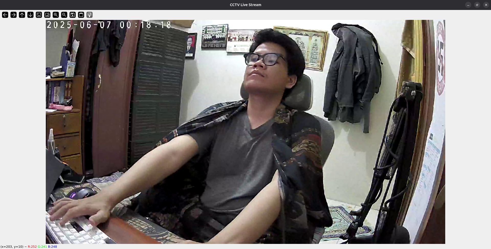

# Basic Implementation of ONVIF Protocol Connection on Desktop using Python

Proyek ini merupakan implementasi dasar dari protokol ONVIF untuk mengakses dan mengontrol kamera CCTV berbasis ONVIF melalui desktop menggunakan Python. Proyek ini memungkinkan:

- Mendapatkan URL RTSP dari kamera ONVIF.
- Menampilkan live stream dari CCTV menggunakan OpenCV.
- Mengontrol gerakan kamera (PTZ: Pan, Tilt, ~~Zoom~~) dengan tombol keyboard (⬅️➡️⬆️⬇️ dan `s` untuk stop).

## Fitur

- 🔒 Autentikasi ke perangkat ONVIF dengan username dan password.
- 🎥 Streaming video RTSP secara real-time di desktop.
- 🎮 Kontrol kamera menggunakan keyboard:
  - ⬅️ Pan Left
  - ➡️ Pan Right
  - ⬆️ Tilt Up
  - ⬇️ Tilt Down
  - `s` Stop gerakan kamera
  - `q` Keluar dari streaming

## Teknologi

- Python 3.x
- [onvif-zeep](https://pypi.org/project/onvif-zeep/)
- OpenCV (`cv2`)
- Tkinter (untuk mendapatkan ukuran layar)

## Instalasi

1. **Clone repository ini**

```bash
git clone https://github.com/muhmuslimabdulj/basic-implementation-onvif-protocol-on-desktop.git
cd basic-implementation-onvif-protocol-on-desktop
```

2. **Buat virtual environment (opsional tapi disarankan)**

```bash
python -m venv venv
source venv/bin/activate  # Linux/macOS
venv\Scripts\activate     # Windows
```

3. **Install dependensi**

```bash
pip install -r requirements.txt
```

## Cara Penggunaan

Jalankan perintah berikut di terminal:

```bash
python main.py --ip 192.168.1.100 --port 2020 --user admin --password yourpassword
```

> Ganti parameter sesuai dengan IP, port, username, dan password kamera ONVIF yang digunakan.

## Screenshot



## Catatan

- Implementasi dasar ini saya terapkan pada CCTV dengan ONVIF Profile S.
- Port default untuk ONVIF biasanya **2020**, tergantung model CCTV.
- Beberapa kamera mungkin memerlukan konfigurasi tambahan di sisi perangkat agar protokol ONVIF aktif. Misalnya saya ini menggunakan CCTV Tapo C212, yang dimana konfigurasinya saya atur melalui aplikasi mobile dari CCTV Tapo tersebut.
- Tidak semua kamera ONVIF mendukung fitur zoom zoom.
